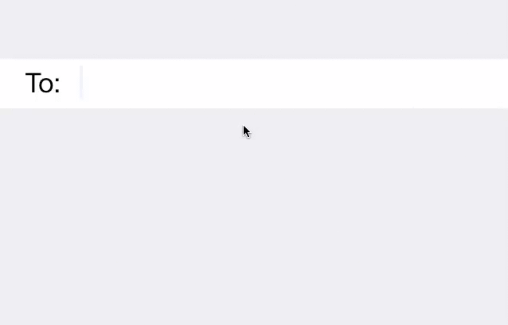

MBContactPicker
===============

## Synopsis

MBContactPicker is an implementation of a contact picker that looks like the one in Apple mail for iOS7. This can be dropped into any project, using interface builder and a few simple lines of code, you can have this custom contact picker into your app in very little time.

I wrote this library to provide an update to the awesome THContactPicker that our company used in the past. My main goal when I created this library was to build something that behaved and felt like the native mail app's contact selector.

My secondary goal was to make using it extremely simple while still providing a high level of flexibility for projects that need it.



## Code Example

The fastest way to get started using this library is to copy the code below:

```objc

#import "ViewController.h"
#import <MBContactPicker.h>

@interface ViewController () <ContactPickerDataSource, ContactPickerDelegate>

@property (nonatomic) NSArray *contacts;
@property (weak, nonatomic) IBOutlet MBContactPicker *contactPickerView;
@property (nonatomic, weak) IBOutlet NSLayoutConstraint *contactPickerViewHeightConstraint;

@end

@implementation ViewController

- (void)viewDidLoad
{
    [super viewDidLoad];
    
    NSArray *array = @[@"Contact 1", @"Contact 2"];
    
	NSMutableArray *contacts = [[NSMutableArray alloc] initWithCapacity:array.count];
    for (NSString *contact in array)
    {
        ContactCollectionViewCellModel *model = [[ContactCollectionViewCellModel alloc] init];
        model.contactObject = nil;
        model.contactTitle = contact;
        [contacts addObject:model];
    }
    self.contacts = contacts;
    
    self.contactPickerView.delegate = self;
    self.contactPickerView.datasource = self;
    [self.contactPickerView reloadData];
}

#pragma mark - ContactPickerDataSource

- (NSArray*)contactModelsForCollectionView:(ContactCollectionView*)collectionView
{
    return self.contacts;
}

#pragma mark - ContactPickerDelegate

- (void)didSelectContact:(ContactCollectionViewCellModel*)model inContactCollectionView:(ContactCollectionView*)collectionView
{
    NSLog(@"Did Select: %@", model.contactTitle);
}

- (void)didAddContact:(ContactCollectionViewCellModel*)model toContactCollectionView:(ContactCollectionView*)collectionView
{
    NSLog(@"Did Add: %@", model.contactTitle);
}

- (void)didRemoveContact:(ContactCollectionViewCellModel*)model fromContactCollectionView:(ContactCollectionView*)collectionView
{
    NSLog(@"Did Remove: %@", model.contactTitle);
}

// This delegate method is called to allow the parent view to increase the size of
// the contact picker view to show the search table view
- (void)showFilteredContacts
{
    if (self.contactPickerViewHeightConstraint.constant <= self.contactPickerView.currentContentHeight)
    {
        [self.view layoutIfNeeded];
        [UIView animateWithDuration:.25 animations:^{
            CGRect pickerRectInWindow = [self.view convertRect:self.contactPickerView.frame fromView:nil];
            CGFloat newHeight = self.view.window.bounds.size.height - pickerRectInWindow.origin.y - self.contactPickerView.keyboardHeight;
            self.contactPickerViewHeightConstraint.constant = newHeight;
            [self.view layoutIfNeeded];
        }];
    }
}

// This delegate method is called to allow the parent view to decrease the size of
// the contact picker view to hide the search table view
- (void)hideFilteredContacts
{
    if (self.contactPickerViewHeightConstraint.constant > self.contactPickerView.currentContentHeight)
    {
        [self.view layoutIfNeeded];
        [UIView animateWithDuration:.25 animations:^{
            self.contactPickerViewHeightConstraint.constant = self.contactPickerView.currentContentHeight;
            [self.view layoutIfNeeded];
        }];
    }
}

// This delegate method is invoked to allow the parent to increase the size of the
// collectionview that shows which contacts have been selected. To increase or decrease
// the number of rows visible, change the maxVisibleRows property of the ContactPickerView
- (void)updateViewHeightTo:(CGFloat)newHeight
{
    [UIView animateWithDuration:.25 animations:^{
        self.contactPickerViewHeightConstraint.constant = newHeight;
    }];
}

@end

```

### Change Color of the Selected Contacts

Thanks to [Roman](http://github.com/firmach) for this enhancement.

```objc
[[ContactCollectionViewCell appearance] setTintColor:[UIColor orangeColor]];
```


## Motivation

This project exists to because no other cocoapods existed that solved the problem of providing a robust contact selector that was easy to implement, used the latest iOS tools, and matched the appearance of iOS7's flat design.

## Installation

Edit your `PodFile` to include the following line:

```
pod 'MBContactPicker'
```

## Contributors

I am actively maintaining this along with the team at Citrrus, so please fork our project and make it better!

Special thanks to [Matt Hupman](http://github.com/mhupman) for putting this library into a project and providing feedback and PRs to make it better.

## License

This project uses the MIT license, so there are no strings attached.
